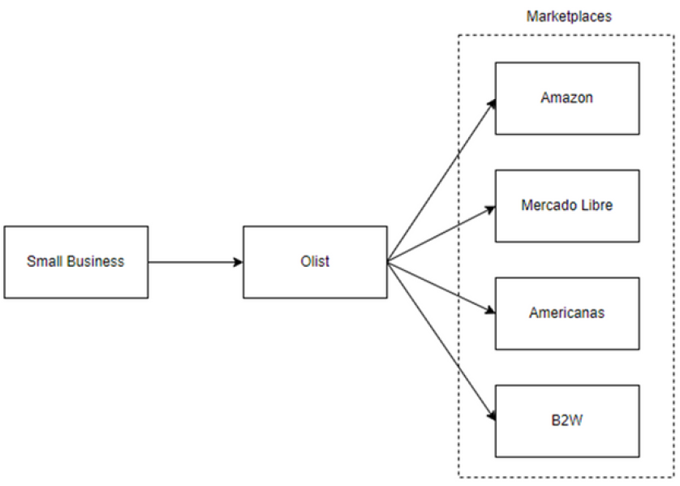
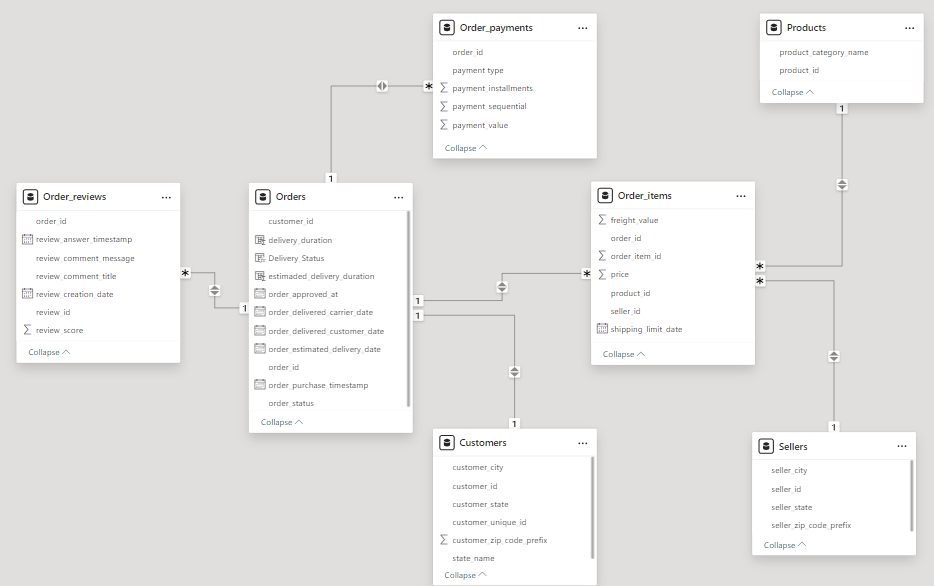
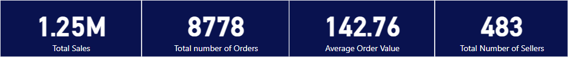
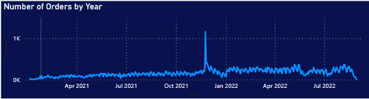

# Olist Insights: Your Path To Marketplace Success

## 1. Context
Olist is a Brazilian technology business offering a SaaS solution to boost sales for small businesses with or without an online presence. Acting like a major department store in principal marketplaces in Brazil, the Olist platform is built on three foundational pillars:
- **Software**: Olist has a platform for sellers that provides them with centralized sales management capabilities. Through this platform, sellers can manage product listings, orders, logistics, payments, and billing. Sellers have access to sales metrics from several marketplaces like Mercado Libre, Amazon, B2W, Americanas, etc.
- **Contracts**: Olist has established agreements with major marketplaces in Brazil and the Brazilian Postal Service. Sellers only sign one contract with Olist to gain access to all these marketplaces and start selling their products, they do not need to sign a contract with each marketplace.
- **Shared reputation**: As a major department store, Olist enjoys a high reputation and popularity among customers in various marketplaces, which benefits all sellers using the platform.

## 2. Problem Statement
In today's fast-paced and competitive e-commerce landscape, success as a seller demands more than just listing products on an online platform. To thrive and stay ahead, sellers need access to real-time, data-driven insights that can guide their decisions, optimize their strategies, and unlock their full potential in the marketplace.
This need for insights is even more critical for new sellers aiming to introduce successful products to the market. By harnessing the power of these insights, new sellers can make informed choices about the products they include in their catalog, enhance product performance, increase customer satisfaction, and ultimately achieve success on the Olist platform.

## 3. Goals and Objectives
### 3.1. Purpose
The purpose of this project is to provide sellers at the Olist store with comprehensive insights and data-driven recommendations through the "Olist Insights" project. With a user-friendly and intuitive dashboard, we aim to empower sellers to make informed decisions, optimize their product performance, and enhance their overall success in the e-commerce marketplace.

### 3.2. Objectives
- **Develop a User-Friendly and Intuitive Dashboard**:
The primary objective of the "Olist Insights" project is to create a user-friendly and intuitive dashboard for sellers on the Olist store. The dashboard serves as a centralized hub, displaying key performance indicators (KPIs) focused on existing and new seller's needs. By presenting critical metrics clearly and visually, the dashboard enables sellers to assess their performance at a glance and gain actionable insights.
- **Analyze Product Performance**:
The project aims to conduct in-depth product performance analysis to assist sellers in optimizing their offerings. Through the aggregation and analysis of sales data, the project will identify the top-performing product categories on Olist. Additionally, it will delve into the underlying factors contributing to the success of high-performing categories. By understanding the drivers of success, sellers can refine their product strategies and capitalize on market opportunities.
- **Provide Actionable Recommendations**:
Building upon the analysis, the "Olist Insights" project aims to deliver actionable recommendations to new sellers. These recommendations encompass various aspects, including sales performance, order values, delivery performance, and customer engagement and satisfaction. By offering business suggestions, sellers can make data-driven decisions that align with their specific goals and drive business growth.
- **Foster Seller Success and Platform Growth**:
Ultimately, the purpose of the "Olist Insights" project is to foster the success of individual sellers while contributing to the overall growth and reputation of the Olist platform. By empowering sellers with valuable data-driven insights and recommendations, the project aims to create a thriving ecosystem where sellers can thrive, customers can enjoy exceptional shopping experiences, and Olist continues to be a trusted and vibrant department store in online marketplaces.

## 4. Data Preprocessing
### 4.1. Data Collection
The data was extracted from https://www.kaggle.com/datasets/olistbr/brazilian-ecommerce?select=olist_order_reviews_dataset.csv

Initially, reviews were in Portuguese, therefore their translation to English was extracted from https://www.kaggle.com/datasets/slimeee8888/english-translated-reviews-for-brazilian-e-comm?select=reviews_translated.csv  

### 4.2. Data Cleaning and Transformation
- **Standardization and Data Type Consistency**: After the data collection phase, efforts were made to standardize the dataset and ensure consistency in data types. This involved converting data fields to a uniform format.

- **Handling Blank, Null, and Impossible Values**: The dataset was thoroughly examined using MS Excel. Blank and null values were addressed through appropriate data imputation techniques. Impossible values were identified and corrected to maintain data integrity.

- **Data Cleaning and Removal of Irrelevant Records**: To maintain data quality and relevance, data from the reviews dataset that contained typos or special characters making the comments incomprehensible were removed from the analysis. Additionally, orders from months before 2021 were removed from the orders, payments, reviews, and order_items datasets.

- **Removal of Rows with Blank Delivery Date**: In the orders table, rows classified as “delivered” but that contained blank delivery dates were removed as they were not useful for the calculations of time ranges. This step was taken to focus the analysis on meaningful feedback and eliminate irrelevant data that could potentially skew insights.

- **Elimination of Unnecessary Columns**: In the product file, unnecessary columns, such as product weight, product length, product height, and product width, were removed. This was done to streamline the dataset and focus on essential variables relevant to the project's objectives.

### 4.3. Calculated Columns and Measures
Measures and columns were calculated using Power BI. They were required to compute the KPIs defined for the project. The following outlines those included in the analysis:
- **Average Order Value**: This corresponds to a calculated measure. It was computed by dividing the total order price and the total number of orders.
- **Average Customer Satisfaction Score**: This corresponds to a calculated measure. It was computed using the average function for the review scores.
- **Delivery Duration**: This corresponds to a calculated column. It was calculated as the difference between the order delivery date and the order approval date.
- **Estimated Delivery Duration**: This corresponds to a calculated column. It was calculated as the difference between the order's estimated delivery date and the order approval date.
- **Delivery Status**: This corresponds to a calculated column. It was calculated as the difference between the order’s estimated delivery date and the actual delivery date.

### 4.4. Data Validity
Data validation was conducted through divergent validity testing to ensure the integrity and reliability of the dataset. Divergent validity testing examines whether distinct variables are truly measuring different constructs and are not highly correlated with each other. For this purpose, correlation analysis was performed:
- Payment Installments and Review Score: 0.006194
- Payment Value and Review Score: 0.028363
- Payment Sequential and Estimated Delivery Duration: -0.09557

The correlation coefficient results indicated that the variables in the dataset were distinct and exhibited minimal correlations with each other. Consequently, the dataset is deemed valid for subsequent analyses.

### 4.5. Data Modelling and Normalization
The data model was composed of 7 tables:
- Orders
- Order_reviews
- Order_payments
- Order_ items
- Products
- Customers
- Sellers

The tables contained information on orders from 2021 and 2022 through the Olist profile in all major Brazilian Marketplaces.

All tables were normalized to 3NF, ensuring no transitive dependencies were present, meaning no non-key column was dependent on another non-key column. The following was the final model used as the basis for analyzing and creating the dashboard in Power BI:

## 5. KPIs Definition
Based on the project objectives and data model, we determined KPIs to be used in the analysis to extract insights from the dataset:
- **Total Sales Amount**: It was calculated by adding all order price values for orders placed in 2021 and 2022 through Olist.
- **Total Number of Orders**: It was calculated by counting the unique order IDs for orders placed in 2021 and 2022 through Olist.
- **Top-performing Product Categories**: It helps identify the product categories that generated the highest sales amount in Olist. To calculate it we summed the price of all orders and categorized it by product category to display the top 10 with the highest sales amount.
- **Underperforming Product Categories**: It helps identify the product categories with the lowest sales amount on the Olist store. To calculate it we computed the total number of orders and categorized it by product category to display the top 10 with the lowest sales amount.
- **Average Order Value**: It measures the average value of orders placed by customers. We computed it by dividing the total sum of order prices and the total number of orders. It is important to mention that each order can include several products, therefore the total price of all products for an order was considered for the calculation without including the freight value, which is directly paid by the customer. 
- **Total number of Sellers**: It was calculated by adding the number of sellers available in Olist. This KPI can provide new sellers with the number of existing competitors in Olist. In addition, new sellers can relate the results of a product category to a defined number of existing sellers.
- **Average Customer Satisfaction Score**: We aggregated and averaged the review score. This KPI can provide insights into the satisfaction level per product category, delivery status, and delivery duration.
- **Average Delivery Duration**: It measures the time it takes a seller to fulfill an order by delivering the purchased product to the customer. It was calculated by averaging the difference between the date all purchases were approved and the date they were delivered to the customer’s location.
- **Average Estimated Delivery Duration**: we computed the average difference between the estimated delivery date and the order-approved date. The estimated delivery duration is the date provided to the customer at the purchase moment.
- **Delivery Status**: It helps classify if an order was delivered on time or late. To calculate it we computed the difference between the estimated delivery date and the actual delivery date to the customer.

## 6. Dashboard Overview
Two dashboards were created using Power BI, each with a different focus. The first dashboard is focused on business performance, more specifically on sales:

  
The second dashboard is focused on customer satisfaction:

## 7. Analysis Questions
### 7.1. What are the top 5 overperforming and underperforming product categories on Olist?

The top 5 products based on their sales amount are:
1.	Health and Beauty with R$ 1.25M
2.	Watches – Gifts with R$ 1.20M
3.	Bed – Bath – Table articles with R$ 1.04M
4.	Sports – Leisure with R$ 0.98M
5.	Computer Accessories with R$ 0.91M

The 5 underperforming products based on their sales amount are:
1.	Insurance and Services with R$ 0.3K
2.	Fashion – Children's Clothes with R$ 0.6K
3.	CDs– DVDs – Musicals with R$ 0.7K
4.	Flowers with R$ 1.1K
5.	Diapers and Hygiene with R$ 1.4K

### 7.2. How does the best-performing product category compare with the worst-performing category?

The best-performing category is Health and Beauty. It has a total of 8778 orders across the entire country with an average value of almost R$ 143 per order, and 483 sellers in Olist.
  
  

On the other hand, the worst-performing category is Insurance and Services with only 2 orders, an average value of R$ 141.50 per order, and 2 registered sellers in Olist.
This shows that despite having a high average product value Insurance and Services is a category with no demand and the lowest interest among sellers.

### 7.3. Does the best-performing product category have the highest number of orders and the highest average order value?

In both cases, the answer is no. The product category with the highest number of orders is Bed – Bath – Table articles with a total of 9408 but with an average order value of R$ 110.
  
  

On the other hand, the product category with the highest average order value is Watches – Gifts with R$ 214 but with a total number of 5619 orders. This shows that the key to a category achieving the best performance is finding the balance between sales volume and product price but with more emphasis on sales volume. This factor seems to have a greater impact on success.

### 7.4. Is there a state with the most concentrated sales revenue?

The State of Sao Paulo has the highest concentrated sales amount with R$ 5.2M, followed by the State of Rio de Janeiro with R$ 1.8M and the State of Minas Gerais with R$ 1.6M.
These three states have accumulated 63% of total sales, showing that the southeast area of the country is the best location for new sellers to establish their businesses.

### 7.5. Is there any date with the highest concentrated number of orders?

Yes, the month of November 2021 registered the highest number of orders with7451 orders. This unusual pattern is even more visible on 24 November, with 1166 orders. The reason behind this is Black Friday and the launch of offers and discounts.

### 7.6. What is the average satisfaction score and how does the best-performing product category compare with it?

The average satisfaction score is 4.09. The top-performing product category, Health, and Beauty, has an average satisfaction score of 4.19. This value shows that customers in general are satisfied with Health and Beauty products.

### 7.7. Is there any relation between the delivery duration and the customer satisfaction score?

Yes, deliveries within 2 days had the highest average satisfaction score of 4.47. By contrast, deliveries that took 49 days received the lowest average satisfaction score with 1.46 points.
The maximum delivery duration that still received a good satisfaction score from customers was 20 days. Beyond this range, customers gave below 4 points in their reviews.

### 7.8.	What is the proportion of orders that were delivered late? How is their average delivery duration compared with their average estimated delivery duration?

6.79% of the orders were delivered late. These orders have an average delivery duration of 33.29 days compared with the estimated delivery duration of 22.67 days. Additionally, customers reviewed these orders with an average of 2.27 points.
  
  

In comparison, 93% of orders that were delivered on time were delivered 13 days in advance of their estimated delivery duration and received 4.29 points in the reviews.

### 7.9. What are the most relevant words placed by customers in their positive and negative reviews?

For positive reviews with scores between 4 and 5 points, they placed words like great, excellent, recommended, very good, efficient, quality, and satisfied.
  
  

For negative reviews with scores between 1 and 2 points, they placed the following words: not recommend, different, delivery, missing, defective, wrong, and incomplete.

## 8. Key Outcomes and Recommendations
### 8.1. **Sales performance**:

The top 3-performing product categories on Olist are Health and Beauty, Watches - Gifts, and Bed - Bath - Table articles. New sellers should focus on these categories to leverage their success.
Some products from Health and Beauty include cases for professional makeup cosmetics, hand sanitizing gel, portable electric face epilator, etc.

Conversely, Insurance and Services, Fashion - Children's Clothes, and CDs - DVDs -Musicals, are the under-performing product categories. New sellers should carefully evaluate these categories and, if possible, avoid them or consider potential improvements and adjustments to their offerings.
Some products for Insurance and Services include reading material like books for Social Security and Insurance Analysts.

### 8.2. **Regional Sales Concentration**:

The States of Sao Paulo, Rio de Janeiro, and Minas Gerais are the top three states that concentrate the highest sales amount. New sellers should consider targeting these regions to capitalize on the higher sales potential.

### 8.3. **Balancing Order Volume and Order Value**:

The best-performing product category, Health and Beauty, has a high order volume with a relatively good average order value. New sellers should strive to find the right balance between order volume and product prices to achieve optimal performance, but ultimately order volume has the highest impact on top-performing products.

### 8.4. **Black Friday and Peak Sales Months**:

The month of November 2021, particularly on Black Friday, experienced the highest number of orders. New sellers should plan and strategize their promotions and discounts during this month to capitalize on increased consumer demand. Additionally, they should take care of their inventory levels at this time to fulfill all orders.

### 8.5. **Customer Satisfaction and Delivery Duration**:

Delivery duration has a significant impact on customer satisfaction. Orders delivered within 20 days received higher satisfaction scores, while deliveries exceeding 20 days saw a decline in customer satisfaction.
Sellers should prioritize efficient and timely deliveries to maintain higher customer satisfaction levels. If possible, deliveries should be within 10 days to maximize the satisfaction score above 4.3 points.

### 8.6. **Review Keywords**:

Positive reviews were associated with words like "great," "excellent," "recommended", "very good," and "satisfied," while negative reviews mentioned issues like "not recommend," "delivery," "missing," "defective," and "wrong."
Sellers should pay attention to customer feedback to improve overall customer experience.
Special attention to delivery duration, missing or incomplete orders, and product quality to avoid defects or differences with images published in marketplaces.

## 9. Conclusion

In conclusion, the "Olist Insights: Your Path to Marketplace Success" project significantly benefits new sellers by providing two user-friendly dashboards and actionable recommendations. It empowers sellers to make data-driven decisions, optimize their strategies, and enhance their competitive edge within the marketplace.

For Olist management, the project offers valuable insights into seller performance, product trends, and customer satisfaction. These insights enable management to better understand seller needs, develop strategies to attract and retain them, improve the platform's reputation, and drive sustainable growth.

Customers benefit from improved satisfaction as sellers align products with their preferences, leading to better shopping experiences, increased loyalty, and improved customer retention.

Overall, the project strengthens Olist's ecosystem and benefits all stakeholders involved.

  
**Contributors**: Chris Portugalisa, Smill Valdez
